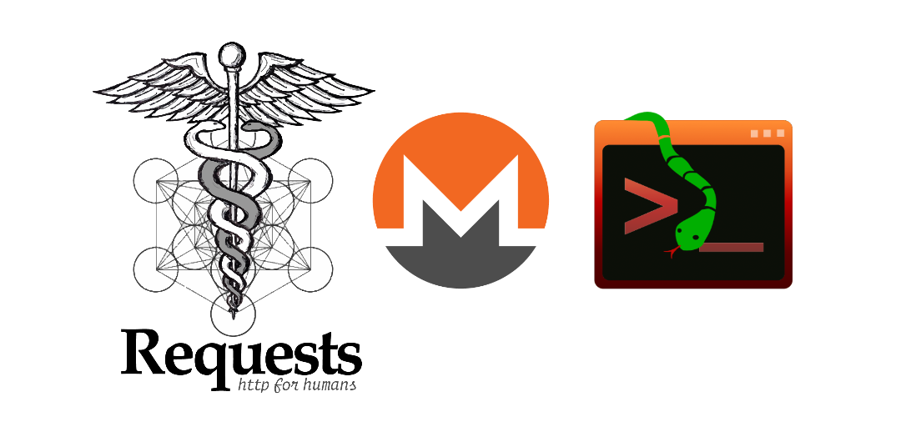

# Monero-api-cli (Currently on v0.1.0-prealpha)     
## Cli for interacting with the MoneroDaemon-RPC API       
    
`monero-api-cli` is a Python cli application meant for remotly interacting with a Monero Daemon via its [RPC API](https://www.getmonero.org/resources/developer-guides/daemon-rpc.html)     
Under the hood it mostly uses the [Prompt-Toolkit module](https://python-prompt-toolkit.readthedocs.io/en/master/) for its [REPL](https://en.wikipedia.org/wiki/Read%E2%80%93eval%E2%80%93print_loop) interface and [Requests](https://requests.readthedocs.io/en/latest/) for the acctual interaction with the API
## Usage:
```
$ monero-api-cli --help
usage: [-h] [-v] [--daemon-address DAEMON_ADDRESS] {help,get_info} ...

Cli for interacting with the MoneroDaemon-RPC API

options:
  -h, --help            show this help message and exit
  -v, --version         show program's version number and exit
  --daemon-address DAEMON_ADDRESS
                        Which daemon address to use, format: [IPv4 address]:[Port number]

RPC methods:
  {help,get_info}
    help                Help information regarding a command
    get_info            Invoke the get_info RPC method
```
If you call the app with no additional arguments it will enter into a REPL cli mode otherwise it will just take the argument as a RPC method.
### Available RPC Methods/Arguments:
#### help    

   
If no additional arguments are passed it will go into REPL mode    
Otherwise it will just take the argument and display the help message asociated with it    
#### get_info    
Calls the get_info RPC method         
#### version (REPL only)
Print current version        
#### exit (REPL only)
Exit the cli REPL mode       
You can also use Ctrl+C to exit        
EOF (Ctrl+D) will trow an error, check TODO       
### Available options:
#### -h, --help
Show help message and exits  
#### -v, --version 
Show current version and exit  
#### --daemon-address
Which daemon address to use, format: [IPv4 address]:[Port number]  
### Example usage:

## Dependencies:
Because the app is bundled using pyinstaller dependencies are _not_ required on the binnary versions     
The dependencies are only required when working direclty with the source (or when using pip, after I add to index)      
Install all python module dependencies with: `pip install -r requirements.txt`        
     
| Name | PyPi Name | What is it used for? |
| ---- | ------- | -------------------- |
| Python | N/A | Necessary for interpreting source code |
| Requests module | `requests` | Used in the implementation of interacting with the API |
| Prompt Toolkit module | `prompt_toolkit` | Used in the implementation of REPL cli mode |
     
## How to install
In the future I'll add the project to PyPi | Check TODO        
Right now you can either use the source code with the Python interpretor directly        
Or you could use the provided binnary available at `dist/monero-api-cli/monero-api-cli`         
### Step 0:
Clone this repo :P   
``` bash
$ git clone https://github.com/Dvd-Znf/monero-api-cli
```
### Step 1 (With binnary):
Use the provided binnary (Linux only!)       
Dependencies are already bundled in, you dont need to install anything!      
``` bash
$ cd monero-api-cli
$ ./dist/monero-api-cli/monero-api-cli
```
If you get permisions error add execute permisions with: `chmod +x <path to binnary>`   
### Step 1 (From source, recommended for development):   
Make sure you have all dependencies installed       
Then just use the Python interpretor on the source code      
``` bash
$ cd monero-api-cli  
$ python src/monero-api-cli  
```
## Why make this from zero when python-monero module already exists?      
This is not meant as a replacement for python-monero module!        
Instead, this is an independent cli application for interacting with monerod via its RPC API        
i.e. cli-app & no wallet RPC        
This is mostly ment for monero node operators who would like a nice, intuitive and easy way to interact with their daemon    
This is the reason I made this.      
python-monero last update to its source code was more than a year ago, even tho it could use some improvements, at least to its docs.     
This is activly developed.      
After first realse you may integrate monero-api-cli into whatever you want but thats not my problem/focus.      
## Can't you ssh into your node then just use monerod?      
Some setups require the daemon to be non-interactive       
Also that sound super laaaameeeeeee       
## TODO:    
- Make /etc/ config file (TOML like maybe idk)
    - Add config option for changing default daemon address
- Add error handling for EOF (End Of File)   
- Choose a build-backend and make pyproject.toml   
### TODO for v0.1.0:
- Package Python Project (And add it to PYPI)    
### TODO for v1.0.0:       
- Implement more of the API :P     
